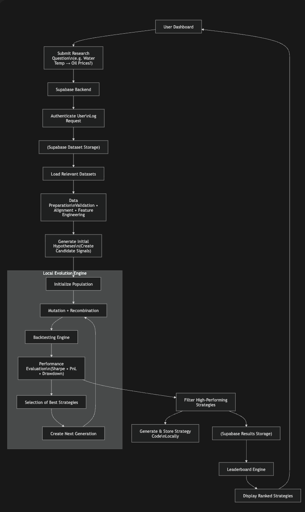

# Alphalution

**Alphalution** is an experimental evolutionary engine for discovering hidden quantitative signals.

Instead of hand-designing strategies one by one, Alphalution explores a different question:

> What if we could evolve quantitative hypotheses instead of manually inventing them?

Starting from a user prompt like:

> "Could water temperature influence oil prices?"

the system searches for relevant data, generates candidate hypotheses, and improves them over multiple generations using mutation, recombination, and selection.

## How It Works

Alphalution is designed to connect unrelated or weakly related datasets, such as weather patterns and financial markets, and test whether non-obvious relationships can be turned into viable trading signals.

The system:

1. Validates whether relevant datasets exist for the proposed variables.
2. Generates initial candidate strategies linking those variables.
3. Mutates and recombines hypotheses across generations.
4. Evaluates performance using metrics such as Sharpe ratio and PnL.
5. Selects the strongest performers while discarding weaker ideas.

Over time, weak hypotheses die off, stronger ones survive, and entirely new signals can emerge, including ones no human explicitly designed.

## Output

The result is a leaderboard of evolved strategies, each with:

- A natural-language explanation of the hypothesis
- Reproducible code for testing or backtesting
- Performance-based ranking across generations

## Vision

Alphalution is built around the idea that alpha discovery can be treated as an evolutionary search problem. By combining data validation, hypothesis generation, and survival-of-the-fittest selection, the system aims to uncover unconventional signals hiding across domains.

## Workflow

